# INSTALASI GIT BASH
**Cara download Git Bash di laptop windows 10 berikut step bystepnya :
1. Buka di leptop kalian google atau chroome dan masuk kewebsiet resmi GIT yaitu "https://git-scm.com/"
2. Setelah kalian masuk kalian tekan **DOWNLOAD** dibagian gambar yang saya tandain.
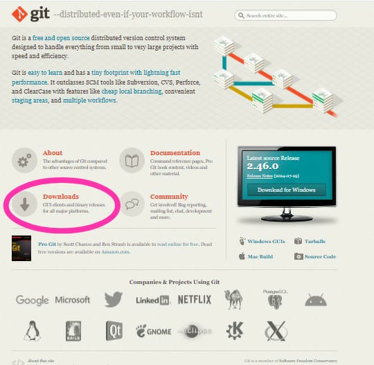

3. Setelah kalian tekan maka ada 3 pilihan merek leptop yaitu macOS, Windows, dan Linus/Unisx karna berhubungan laptop saya windows maka saya pilih windows seperti digambar berikut.
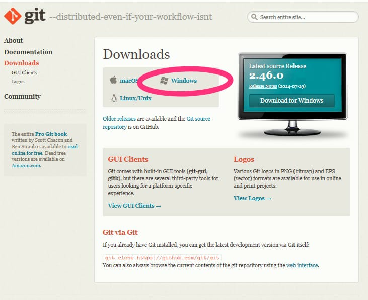

4. Setelah kalian sudah memilih merek laptop kalian berikutnya kalian disuruh memilih kualitas GIT terserah kalian mau memilih apa, jadi saya memilih 64-Bit berikut contohnya.
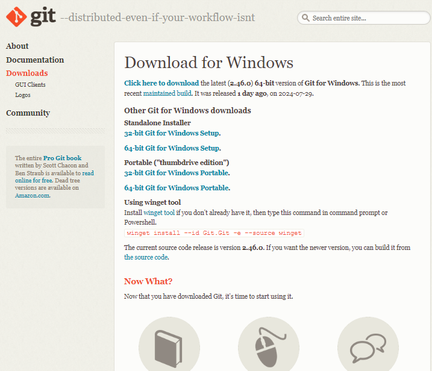

5. Sesudah kalian memilih maka aplikasi otomatis terinstal dan tunggu sampai selesai, berikut step berikutnya.
6. Setelah terinstal maka kalian masuk kedalam file kalian dan cari dimana kalian simpan, berhubungan saya menyimpannya di Data D: seperti gambar berikut.
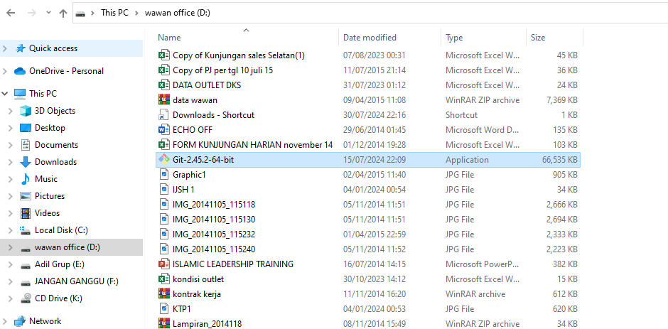

7.  Berikut caranya Klik *Next* untuk melanjutkan installasi.
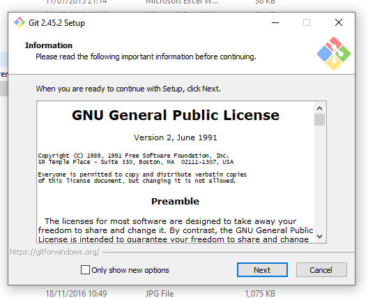
8. Lalu Anda akan diminta untuk memberi lokasi folder GIT. Lokasi tersebut dapat Anda letakkan dimanapun. Jika sudah, maka klik Next.

9. Pilihlah komponen-komponen yang ingin Anda Install di GIT. Disini saya hanya memerlukan *Windows Explorer Integration, Git Bash Here, Git GUI Here, Git LFS, Associate .git configuration files with the default text editor, dan Associate .sh* files to be run with Bash. Jika sudah selesai memilih komponen yang dibutuhkan, maka klik **Next.

10. Klik *Next*.
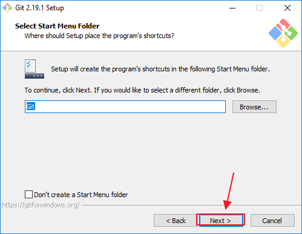

11. Kemudian pilihlah default editor yang akan digunakan oleh GIT, disini pilih saja **Use Vim (the ubiquitous text editor) as Git’s default editor**. Setelah itu klik **Next.
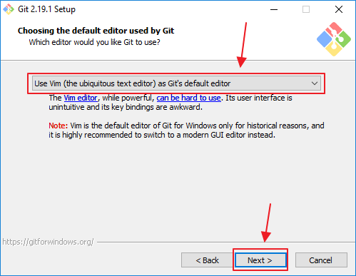

12. Pilih **Use Git from the Windows Command Prompt* dan klik** *Next*.
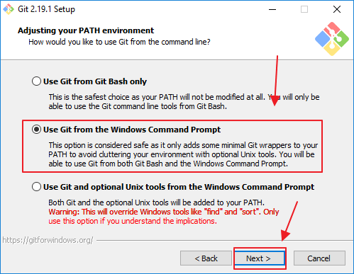

13. Selanjutnya Anda akan diminta untuk memilih SSL/TLS library yang akan GIT gunakan koneksi HTTPS. Anda dapat memilih **Use the OpenSSL library**. Lalu klik **Next.
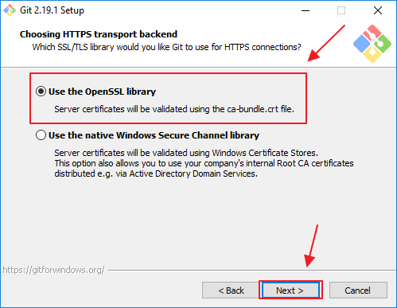

14. Kemudian Anda harus memilih konfigurasi line ending konfersi. Pilih **Checkout Windows-style, commit Unix-style line endings**. Lalu klik **Next.
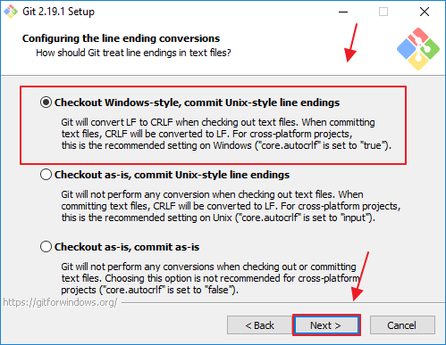

15. Setelah itu Anda akan diminta untuk mengkonfigurasi terminal emulator yang akan digunakan Git Bash. Disini Anda dapat memilih **Use Windows’ default console window**. Kemudian klik **Next.
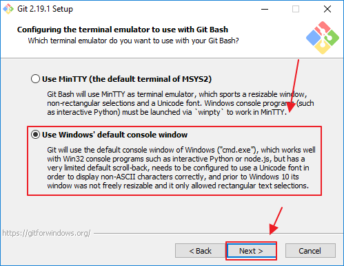
16. Anda juga dapat menambahkan pilihan ekstra fitur yang Anda inginkan. Disini saya memilih **Enable file system caching dan Enable Git Credential Manager**. Setelah itu klik tombol **Next.
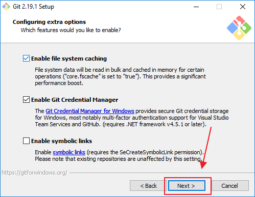
17. Untuk konfigurasi ini saya tidak memilih satu pun karena itu tidak saya butuhkan. Jika Anda membutuhkan **experimental options** tersebut, Anda dapat memberikan centang pada kotak tersebut. Kemudian klik tombol *Install*.
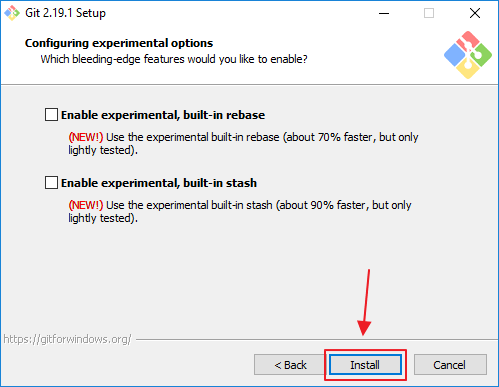
18. Tunggulah beberapa saat sampai proses instalasi selesai. Proses instalasi tidak berlangsung lama, hanya dalam hitungan menit saja, sehingga Anda dapat menunggunya.
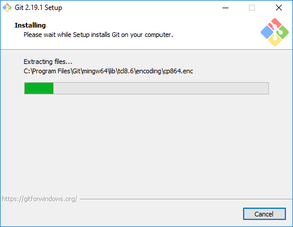
19. Jika proses instalasi telah selesai, maka kini Anda sudah selesai menginstal aplikasi GIT. Klik tombol **finish** untuk mengakhiri proses instalasi.

20. Langkah terakhir yang harus dilakukan yaitu mengecek apakah GIT sudah terinstall seluruhnya di komputer kita. Caranya yaitu dengan membuka *Command Prompt* dan ketikkan perintah *git –version*. Jika GIT sudah terinstall, maka akan muncul barus seperti pada gambar dibawah ini.
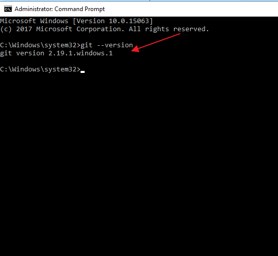

#  Masuk ke GitHub
**Cara loginkan akun git hub menggunakan chroom*
1. Buka [https://github.com](https://github.com/) di browser web, lalu pilih **Sign in.
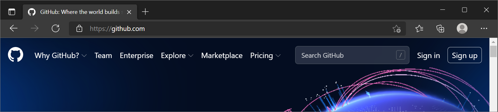
2. Masukkan alamat email anda dan masukkan kata sandi 

3. Untuk akun GitHub baru Anda, dan **Masukkan nama** pengguna juga. Selanjutnya, pilih apakah Anda ingin menerima pembaruan dan pengumuman melalui email, lalu pilih **Lanjutkan**.
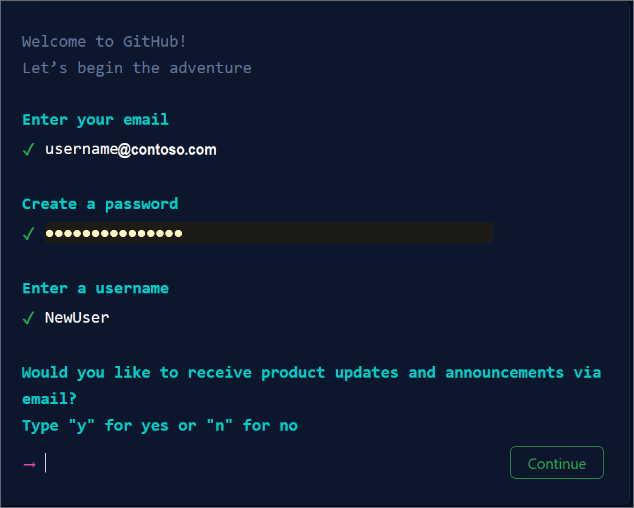
4. Verifikasi akun Anda dengan memecahkan teka-teki. Pilih tombol *Mulai Teka-teki* untuk melakukannya, lalu ikuti perintah.
5. Setelah Anda memverifikasi akun Anda, pilih tombol *Buat akun* .
6. Selanjutnya, GitHub mengirimkan kode peluncuran ke alamat email Anda. Ketik kode peluncuran tersebut *dalam dialog Masukkan kode* , lalu tekan *Enter*.

7. Di layar Tempat tim berkolaborasi dan mengirim, Anda dapat memilih apakah Anda ingin menggunakan akun Gratis atau akun Tim. Untuk memilih **akun Gratis** , pilih tombol Lewati personalisasi .
8. GitHub membuka halaman yang dipersonalisasi di browser Anda.
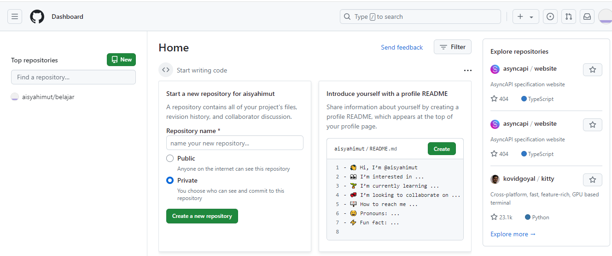
9. Selamat Anda **berhasil** membuat akun GitHub Anda.

# Buat Repository di Github

## Langkah-langkah
1. **Buat Repositori GitHub Baru :
   - Login ke akun GitHub anda.
   - Klik tombol **New repository** untuk membuat repositori baru.
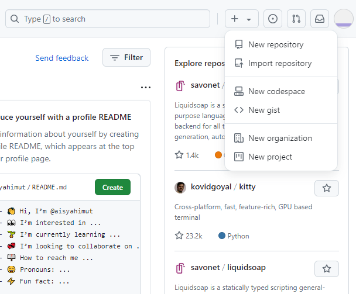

- Isi nama repository dan deskripsinya. Di github ada dua jenis repository yaitu public dan private. Public artinya repository kita bisa diliat oleh semua orang sedangkan private itu nanti yg bisa liat cuma kita dan team yang kita tentukan saja, tetapi untuk private ini kita dikenakan biaya langganan $7/month. Untuk awal kita buat public terlebih dahulu untuk perkenalan dengan teknologinya, baru nanti kalau sudah mulai faham anda bisa _upgrade plan_ ke paket private sendiri. Setelah itu klik **Create Repository**
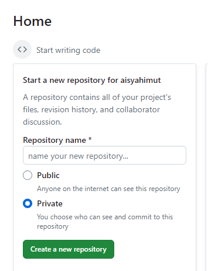
## Perbedaan repository Public dan Private
####  1. **Repository Public**

- **Aksesibilitas**: Repository publik dapat diakses oleh siapa saja. Siapa pun dengan link atau alamat URL repository dapat melihat, mengunduh, dan bahkan berkontribusi jika pengaturan izin memungkinkan.
- **Visibilitas**: Kode sumber dan riwayat perubahan dapat dilihat oleh seluruh dunia. Ini berguna untuk proyek open-source di mana kolaborasi dan transparansi sangat penting.
- **Penggunaan Umum**: Repository publik sering digunakan untuk proyek-proyek open-source yang bertujuan untuk berkolaborasi dengan komunitas luas, berbagi pengetahuan, atau mempromosikan transparansi.
#### 2. **Repository Private**

- **Aksesibilitas**: Repository privat hanya dapat diakses oleh pengguna atau kelompok yang telah diberi izin khusus. Akses ini biasanya diatur oleh pemilik repository atau administrator proyek.
- **Visibilitas**: Kode sumber dan riwayat perubahan hanya bisa dilihat oleh orang-orang yang memiliki akses. Ini sering digunakan untuk proyek internal, data sensitif, atau proyek yang belum siap untuk publikasi.
- **Penggunaan Umum**: Repository privat sering digunakan untuk proyek-proyek yang memerlukan kerahasiaan, seperti proyek pengembangan perangkat lunak perusahaan atau proyek pribadi yang belum siap untuk diumumkan kepada publik.

   1. **Konfigurasi Git Lokal:
   - Buka git di laptop/komputer anda.
   - Jalankan perintah berikut untuk mengatur identitas Anda:
~~~CS
     git config --global user.name "Nama Anda"
     git config --global user.email "email@example.com"
~~~  

**Note: untuk melihat apakah sudah terhubung konfigurasi git nya silakan ketik `git config --list`
 contohnya: 

# Konfigurasi Awal di Git Bash
1.**Konfigurasi Git Lokal:
   - Buka git di laptop/komputer anda.
   - Jalankan perintah berikut untuk mengatur identitas Anda:
  ~~~cs
    git config --global user.name "Nama Anda"
    git config --global user.email "email@example.com"
~~~
untuk melihat apakah sudah terhubung konfigurasi git nya silakan ketik  git config --list
 **contohnya:**
 
     
2.**Inisialisasi Git Lokal:
-  Buat direktori baru untuk proyek Anda dan navigasikan ke direktori tersebut menggunakan Git bash. Kemudian, inisialisasi Git di direktori tersebut dengan menjalankan perintah:
~~~cs
   git init
~~~
**contohnya:

4.**Hubungkan ke Repositori GitHub:
   - Jalankan perintah berikut untuk menghubungkan repositori lokal Anda ke repositori GitHub yang telah Anda buat sebelumnya:
~~~cs
     git remote add origin https://github.com/username/nama-repository.git
~~~
   Ganti username dan nama-repository dengan nama pengguna GitHub Anda dan nama repositori yang Anda buat.kalo dah ada tulisan (master),berarti sudah terhubung ke repositori Githubnya
   **contohnya:

#  Git Status
**Penjelasan:`git status` adalah perintah dalam sistem kontrol versi Git yang digunakan untuk menampilkan status dari repository Git saat ini. Perintah ini memberikan informasi mengenai:
1. **Perubahan yang telah dilakukan:** Menunjukkan file-file yang telah diubah, tetapi belum di-stage untuk commit.
2. **File yang di-stage:** Menunjukkan file-file yang telah di-stage dan siap untuk di-commit.
3. **File yang belum dilacak:** Menunjukkan file-file baru yang belum ditambahkan ke dalam repository.

Dengan menggunakan `git status`, Kita dapat melihat status dari repository Kita, memahami apa yang telah berubah, dan memutuskan tindakan selanjutnya, seperti menambahkan file ke staging area atau melakukan commit perubahan.

**Hasilnya :

5.**Tambahkan file ke repositori: 
   - Perintah ini akan menambahkan semua file di direktori saat ini ke repositori.
   - Tambahkan file yang ingin Anda simpan di repositori Git dengan menjalankan perintah:
~~~cs
    git add .
~~~    
   **contohnya:

6.**Buat Commit:
   - Jalankan perintah berikut untuk membuat commit dengan pesan yang jelas:
   - Perintah git commit -m *"Pesan commit"* digunakan untuk menyimpan perubahan yang telah dilakukan pada repositori Git dengan menambahkan pesan
~~~cs
     git commit -m "Pesan commit"
~~~   
   **contohnya:

   Unggah ke GitHub (git push origin master) :
   Terakhir, jalankan perintah berikut untuk mengunggah kode Anda ke GitHub:

7.**Unggah ke GitHub:
   - Terakhir, jalankan perintah berikut untuk mengunggah kode Anda ke GitHub:
~~~cs
     git push -u origin master
~~~

   **contohnya:
     ![[git push origin.jpg]]
     maka akan tetampil bgini,berarti anda disuruh untuk login akun github mu yang sudh kamu buat 
     ![[login.jpg]]
   Perintah ini akan mengunggah kode Anda ke repositori GitHub. Setelah ini, setiap kali Anda membuat perubahan pada kode, Anda dapat mengulangi langkah 4, 5,6 dan 7 untuk mengunggah perubahan tersebut ke GitHub.
# Buat File Lokal
Bukalah gitbash lalu letakkan Gitbash ke tempat yang kalian ingin tuju,disini saya ambil dimana saya simpan data saya D:/obsidian
## Git version
**Perintah  dalam Git version:
   Perintah `git --version` digunakan untuk menampilkan versi Git yang terinstall pada komputer Anda.
   
~~~cs
git --version
~~~

  **Fungsi: Perintah ini berguna untuk memeriksa versi Git yang Anda gunakan, yang dapat bermanfaat dalam mengidentifikasi dan mengatasi masalah kompatibilitas.

