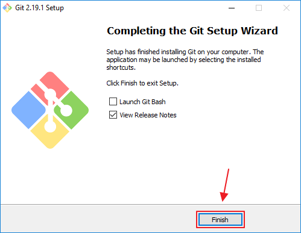
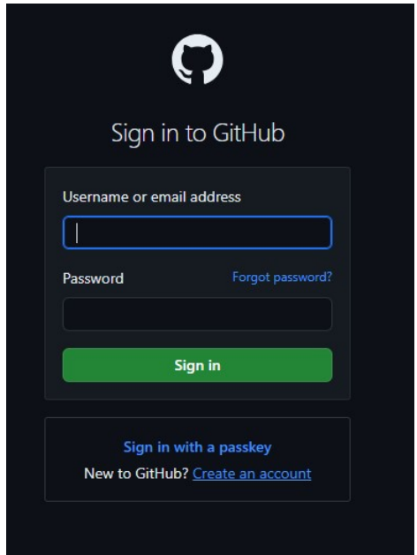
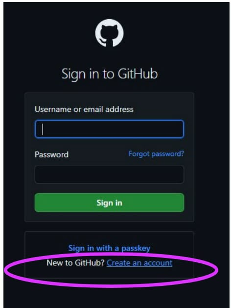

# INSTALASI GIT BASH
**Cara download Git Bash di laptop windows 10 berikut step bystepnya :
1. Buka di leptop kalian google atau chroome dan masuk kewebsiet resmi GIT yaitu "https://git-scm.com/"
2. Setelah kalian masuk kalian tekan **DOWNLOAD** dibagian gambar yang saya tandain.

3. Setelah kalian tekan maka ada 3 pilihan merek leptop yaitu macOS, Windows, dan Linus/Unisx karna berhubungan laptop saya windows maka saya pilih windows seperti digambar berikut.

4. Setelah kalian sudah memilih merek laptop kalian berikutnya kalian disuruh memilih kualitas GIT terserah kalian mau memilih apa, jadi saya memilih 64-Bit berikut contohnya.

5. Sesudah kalian memilih maka aplikasi otomatis terinstal dan tunggu sampai selesai, berikut step berikutnya.
6. Setelah terinstal maka kalian masuk kedalam file kalian dan cari dimana kalian simpan, berhubungan saya menyimpannya di Data D: seperti gambar berikut.

7.  Berikut caranya Klik *Next* untuk melanjutkan installasi.

8. Lalu Anda akan diminta untuk memberi lokasi folder GIT. Lokasi tersebut dapat Anda letakkan dimanapun. Jika sudah, maka klik Next.

9. Pilihlah komponen-komponen yang ingin Anda Install di GIT. Disini saya hanya memerlukan *Windows Explorer Integration, Git Bash Here, Git GUI Here, Git LFS, Associate .git configuration files with the default text editor, dan Associate .sh* files to be run with Bash. Jika sudah selesai memilih komponen yang dibutuhkan, maka klik **Next.

10. Klik *Next*.

11. Kemudian pilihlah default editor yang akan digunakan oleh GIT, disini pilih saja **Use Vim (the ubiquitous text editor) as Git’s default editor**. Setelah itu klik **Next.

12. Pilih **Use Git from the Windows Command Prompt* dan klik** *Next*.

13. Selanjutnya Anda akan diminta untuk memilih SSL/TLS library yang akan GIT gunakan koneksi HTTPS. Anda dapat memilih **Use the OpenSSL library**. Lalu klik **Next.

14. Kemudian Anda harus memilih konfigurasi line ending konfersi. Pilih **Checkout Windows-style, commit Unix-style line endings**. Lalu klik **Next.

15. Setelah itu Anda akan diminta untuk mengkonfigurasi terminal emulator yang akan digunakan Git Bash. Disini Anda dapat memilih **Use Windows’ default console window**. Kemudian klik **Next.

16. Anda juga dapat menambahkan pilihan ekstra fitur yang Anda inginkan. Disini saya memilih **Enable file system caching dan Enable Git Credential Manager**. Setelah itu klik tombol **Next.

17. Untuk konfigurasi ini saya tidak memilih satu pun karena itu tidak saya butuhkan. Jika Anda membutuhkan **experimental options** tersebut, Anda dapat memberikan centang pada kotak tersebut. Kemudian klik tombol *Install*.

18. Tunggulah beberapa saat sampai proses instalasi selesai. Proses instalasi tidak berlangsung lama, hanya dalam hitungan menit saja, sehingga Anda dapat menunggunya.

19. Jika proses instalasi telah selesai, maka kini Anda sudah selesai menginstal aplikasi GIT. Klik tombol **finish** untuk mengakhiri proses instalasi.

20. Langkah terakhir yang harus dilakukan yaitu mengecek apakah GIT sudah terinstall seluruhnya di komputer kita. Caranya yaitu dengan membuka *Command Prompt* dan ketikkan perintah *git –version*. Jika GIT sudah terinstall, maka akan muncul barus seperti pada gambar dibawah ini.

#  Masuk ke GitHub
**Cara loginkan akun git hub menggunakan chroom*
1. Buka [https://github.com](https://github.com/) di browser web, lalu pilih **Sign in.

2. Masukkan alamat email anda dan masukkan kata sandi 

3.Jika tidak memiliki akun klik tambahkan akun.

4.Selanjutnya untuk akun GitHub baru Anda, dan **Masukkan nama email dan password email**. Selanjutnya, pilih apakah Anda ingin menerima pembaruan dan pengumuman melalui email, lalu pilih **Continue**.

4. Verifikasi akun Anda dengan memecahkan teka-teki. Pilih tombol *Mulai Teka-teki* untuk melakukannya, lalu ikuti perintah.
5.  Selanjutnya, GitHub mengirimkan kode peluncuran ke alamat email Anda. Ketik kode peluncuran tersebut *dalam dialog Masukkan kode* , lalu tekan *Enter*.

7. Di layar Tempat tim berkolaborasi dan mengirim, Anda dapat memilih apakah Anda ingin menggunakan akun Gratis atau akun Tim. Untuk memilih **akun Gratis** , pilih tombol Lewati personalisasi .
8. GitHub membuka halaman yang dipersonalisasi di browser Anda.

9. Selamat Anda **berhasil** membuat akun GitHub Anda.

# Buat Repository di Github

## Langkah-langkah
1. **Buat Repositori GitHub Baru :
   - Login ke akun GitHub anda.
   - Klik tombol **New repository** untuk membuat repositori baru.

- Isi nama repository dan deskripsinya. Di github ada dua jenis repository yaitu public dan private. Public artinya repository kita bisa diliat oleh semua orang sedangkan private itu nanti yg bisa liat cuma kita dan team yang kita tentukan saja, tetapi untuk private ini kita dikenakan biaya langganan $7/month. Untuk awal kita buat public terlebih dahulu untuk perkenalan dengan teknologinya, baru nanti kalau sudah mulai faham anda bisa _upgrade plan_ ke paket private sendiri. Setelah itu klik **Create Repository**

## Perbedaan repository Public dan Private
####  1. **Repository Public**

- **Aksesibilitas**: Repository publik dapat diakses oleh siapa saja. Siapa pun dengan link atau alamat URL repository dapat melihat, mengunduh, dan bahkan berkontribusi jika pengaturan izin memungkinkan.
- **Visibilitas**: Kode sumber dan riwayat perubahan dapat dilihat oleh seluruh dunia. Ini berguna untuk proyek open-source di mana kolaborasi dan transparansi sangat penting.
- **Penggunaan Umum**: Repository publik sering digunakan untuk proyek-proyek open-source yang bertujuan untuk berkolaborasi dengan komunitas luas, berbagi pengetahuan, atau mempromosikan transparansi.
#### 2. **Repository Private**

- **Aksesibilitas**: Repository privat hanya dapat diakses oleh pengguna atau kelompok yang telah diberi izin khusus. Akses ini biasanya diatur oleh pemilik repository atau administrator proyek.
- **Visibilitas**: Kode sumber dan riwayat perubahan hanya bisa dilihat oleh orang-orang yang memiliki akses. Ini sering digunakan untuk proyek internal, data sensitif, atau proyek yang belum siap untuk publikasi.
- **Penggunaan Umum**: Repository privat sering digunakan untuk proyek-proyek yang memerlukan kerahasiaan, seperti proyek pengembangan perangkat lunak perusahaan atau proyek pribadi yang belum siap untuk diumumkan kepada publik.

   1. **Konfigurasi Git Lokal:
   - Buka git di laptop/komputer anda.
   - Jalankan perintah berikut untuk mengatur identitas Anda:
~~~CS
     git config --global user.name "Nama Anda"
     git config --global user.email "email@example.com"
~~~  

**Note: untuk melihat apakah sudah terhubung konfigurasi git nya silakan ketik `git config --list`
 contohnya: 

# Konfigurasi Awal di Git Bash
## **Konfigurasi Git Lokal:
   - Buka git di laptop/komputer anda.
   - Jalankan perintah berikut untuk mengatur identitas Anda:
  ~~~cs
    git config --global user.name "Nama Anda"
    git config --global user.email "email@example.com"
~~~
untuk melihat apakah sudah terhubung konfigurasi git nya silakan ketik  git config --list
 **contohnya:**
 
     
## **Inisialisasi Git Lokal:
-  Buat direktori baru untuk proyek Anda dan navigasikan ke direktori tersebut menggunakan Git bash. Kemudian, inisialisasi Git di direktori tersebut dengan menjalankan perintah:
~~~cs
   git init
~~~
**contohnya:

## **Hubungkan ke Repositori GitHub:
   - Jalankan perintah berikut untuk menghubungkan repositori lokal Anda ke repositori GitHub yang telah Anda buat sebelumnya:
~~~cs
     git remote add origin https://github.com/username/nama-repository.git
~~~
   Ganti username dan nama-repository dengan nama pengguna GitHub Anda dan nama repositori yang Anda buat.kalo dah ada tulisan (master),berarti sudah terhubung ke repositori Githubnya
   **contohnya:

## **Tambahkan file ke repositori:

Penjelasan : `git add` adalah salah satu perintah dasar dalam Git, dan sangat penting untuk memahami cara kerja Git. Di Git Bash, `git add` digunakan untuk menandai perubahan yang telah Anda buat di repositori Anda sehingga mereka bisa dimasukkan ke dalam commit berikutnya.
- Perintah ini akan menambahkan semua file di direktori saat ini ke repositori.
- Tambahkan file yang ingin Anda simpan di repositori Git dengan menjalankan perintah:
~~~cs
git add
~~~
**contohnya :

*Secara singkat, `git add` adalah cara untuk memberi tahu Git bahwa Anda ingin menyertakan perubahan tertentu dalam commit berikutnya.*
# Git Status
Penjelasan: `git status` adalah perintah dalam sistem kontrol versi Git yang digunakan untuk menampilkan status dari repository Git saat ini. Perintah ini memberikan informasi mengenai:
1. **Perubahan yang telah dilakukan:** Menunjukkan file-file yang telah diubah, tetapi belum di-stage untuk commit.
2. **File yang di-stage:** Menunjukkan file-file yang telah di-stage dan siap untuk di-commit.
3. **File yang belum dilacak:** Menunjukkan file-file baru yang belum ditambahkan ke dalam repository.

Dengan menggunakan `git status`, Kita dapat melihat status dari repository Kita, memahami apa yang telah berubah, dan memutuskan tindakan selanjutnya, seperti menambahkan file ke staging area atau melakukan commit perubahan.

**Hasilnya :

# Git Push Origin (Master)
Penjelasan : `git push origin master` adalah salah satu perintah penting dalam Git yang digunakan untuk mengirimkan perubahan dari repositori lokal ke repositori remote, Perintah ini akan mengunggah kode Anda ke repositori GitHub. Setelah ini, setiap kali Anda membuat perubahan pada kode, Anda dapat mengulangi langkah 4, 5,6 dan 7 untuk mengunggah perubahan tersebut ke GitHub.
 **contohya :
 
 **Penjelasan setiap komponen dari perintah tersebut :
- **`git push`** adalah perintah Git yang digunakan untuk mengirimkan perubahan yang telah Anda commit di repositori lokal ke repositori remote (misalnya, GitHub, GitLab, Bitbucket, atau server Git lainnya).
- **`origin`**: Ini adalah nama default dari remote repository yang di-set saat pertama kali Anda meng-clone repositori atau menambahkan remote. `origin` adalah alias untuk URL repositori remote Anda. Anda dapat memiliki beberapa remote dengan nama yang berbeda, tetapi `origin` adalah yang paling umum digunakan.
- **`master`**: Ini adalah nama cabang (branch) di repositori Anda yang ingin Anda push. Dalam konteks Git, `master` adalah cabang default utama dari repositori Git, meskipun banyak proyek modern beralih ke nama cabang default seperti `main` sebagai pengganti `master`.

**Pesan kesalahan :**
- **`fatal: 'origin' does not appear to be a git repository`**: Ini berarti Git tidak dapat menemukan remote repository dengan nama `origin`.
- **`fatal: Could not read from remote repository`**: Ini berarti Git tidak dapat mengakses remote repository.

- jika menunjukkan bahwa Git tidak dapat menemukan atau mengakses remote repository yang bernama `origin`
- Kita Harus menambahkan semua perubahan yang ada di direktori kerja ke staging area menggunakan `git add .`
- Jika Benar, Langkah Selanjutnya kita menggunakan perintah `git status` membantu kita memverifikasi bahwa perubahan sudah berada di staging area dan siap untuk di-commit.

# LS
 Penjelasan : Perintah `ls` adalah perintah yang sangat umum digunakan di lingkungan Unix/Linux, termasuk di Git Bash, yang merupakan emulator terminal untuk Windows yang menyediakan antarmuka shell Unix. Di Git Bash, `ls` digunakan untuk menampilkan daftar file dan direktori dalam direktori kerja saat ini. 
 ~~~cs
 ls
 ~~~
**contohnya:

Perintah `ls` sangat fleksibel dan memiliki banyak opsi lain yang bisa digunakan untuk mengatur tampilan daftar isi direktori sesuai dengan kebutuhan pengguna.

# CD
Penjelasan : perintah `cd` (singkatan dari "change directory") digunakan untuk berpindah antara direktori, Dengan menggunakan perintah `cd` di Git Bash, Kita dapat dengan mudah menavigasi melalui berbagai direktori dalam sistem file Kita. Ini sangat berguna untuk mengelola proyek, mengakses file, dan menja lankan skrip atau program di lokasi yang berbeda.
 ~~~cs
 cd d:
 ~~~
 **contohnya: 
 

### Langkah-langkah yang Dijalankan :
1. **Pindah ke drive `D:`** `cd d:`
- **Penjelasan**: Perintah ini digunakan untuk berpindah ke drive `D:` di komputer Kita.
- **Output**: `Odette@DESKTOP-A90B27J MINGW64 /d`

2. **Pindah ke direktori `obsidian` di dalam drive `D:`**
`cd obsidian`
- **Penjelasan**: Perintah ini digunakan untuk berpindah ke direktori `obsidian` yang berada di dalam drive `D:`.

3. **Pindah ke direktori `belajar_git` di dalam direktori `obsidian`**
`cd belajar_git` 
- **Penjelasan**: Perintah ini digunakan untuk berpindah ke direktori `belajar_git` yang berada di dalam direktori `obsidian`.
- **Output**:
`/d/obsidian/belajar_git `

### Keseluruhan Proses
- **Navigasi Awal:**
Kita memulai di home directory (direktori awal) pada Git Bash. Perintah `cd d:` digunakan untuk berpindah dari home directory ke drive `D:`.

- **Navigasi Kedua:**
- Setelah berada di drive `D:`, Kita menggunakan perintah `cd obsidian` untuk masuk ke dalam direktori `obsidian` yang ada di drive `D:`.

- **Navigasi Ketiga:**
- Dari direktori `obsidian`, Kita menggunakan perintah `cd belajar_git`   untuk masuk ke dalam sub-direktori `belajar_git `.

### Kesimpulan
Kita telah menggunakan serangkaian perintah `cd` di Git Bash untuk menavigasi melalui sistem file dari drive `D:`, kemudian ke direktori `obsidian`, dan akhirnya ke direktori `belajar_git `. Setiap perintah `cd` digunakan untuk berpindah ke direktori yang lebih spesifik dalam hirarki direktori.
# Buat Commit:
   - Jalankan perintah berikut untuk membuat commit dengan pesan yang jelas:
   - Perintah git commit -m *"Pesan commit"* digunakan untuk menyimpan perubahan yang telah dilakukan pada repositori Git dengan menambahkan revisi
~~~cs
     git commit -m "revisi"
~~~   
   **contohnya:

### Penjelasan `git commit -m "revisi"`**
- **`git commit`**: Perintah ini digunakan untuk menyimpan perubahan yang telah ditandai (staged) dengan `git add` ke dalam repositori Git. Ini menciptakan snapshot baru dari keadaan repositori pada saat commit.
    
- **`-m "revisi"`**: Opsi `-m` diikuti dengan string dalam tanda kutip digunakan untuk memberikan pesan commit. Pesan ini adalah deskripsi singkat mengenai perubahan yang telah Anda buat. Dalam contoh ini, `"revisi"` adalah pesan commit yang menjelaskan atau merangkum perubahan yang telah Anda lakukan.
Secara singkat, `git commit -m "revisi"` digunakan untuk menyimpan perubahan ke repositori Git dengan pesan singkat yang menjelaskan perubahan tersebut.
  
## Git version
Penjelasan : **`git version`** Menampilkan informasi versi dari perangkat lunak Git yang terpasang di komputer Anda. Ini membantu Anda memastikan bahwa Anda menggunakan versi yang benar atau terbaru dari Git.
~~~cs
git --version
~~~
 **contohnya :

  **Fungsi: Perintah ini berguna untuk memeriksa versi Git yang Anda gunakan, yang dapat bermanfaat dalam mengidentifikasi dan mengatasi masalah kompatibilitas.

